# Instant Invoice: Fraud Shield 🛡️

**FinLab Challenge - Advanced Payment Fraud Detection System**

A fully containerized microservices solution for real-time payment fraud detection using advanced risk assessment algorithms and machine learning patterns.

## 📋 Table of Contents

- [Objective](#objective)
- [Architecture Overview](#architecture-overview)
- [Functional Requirements](#functional-requirements)
- [Technology Stack](#technology-stack)
- [Quick Start](#quick-start)
- [API Documentation](#api-documentation)
- [Database Schema](#database-schema)
- [Risk Assessment System](#risk-assessment-system)
- [Stress Testing](#stress-testing)
- [Development](#development)
- [Contributing](#contributing)
- [License](#license)

## 🎯 Objective

Create a fully containerized solution consisting of:
- **Front-end & Reverse Proxy** (HTML + CSS + JavaScript + Nginx in container)
- **API Gateway** (Java 21 in container)
- **Cache Service** (Redis in container)
- **Accounts Microservice** (Java 21 in container)
- **Database** (PostgreSQL in container)

## 🏗️ Architecture Overview

```mermaid
graph TB
    User[👤 User] --> Nginx[🌐 Nginx Frontend<br/>Port 443 HTTPS]
    Nginx --> Gateway[🚪 API Gateway<br/>Port 8080]
    Gateway --> Redis[💾 Redis Cache<br/>Port 6379]
    Gateway --> Accounts[🏦 Accounts Service<br/>Port 8081]
    Accounts --> Postgres[🗄️ PostgreSQL<br/>Port 5432]
    
    subgraph "Docker Network"
        Gateway
        Redis
        Accounts
        Postgres
    end
    
    subgraph "External Access"
        User
        Nginx
    end
```



## ⚙️ Functional Requirements

### Front-end & Reverse Proxy
- **Nginx container** with HTTP/2, gzip compression, and self-signed TLS on port 443
- Serves static content and proxies API requests to the Gateway
- Real-time fraud detection dashboard with interactive payment validation
- Responsive design with modern UI/UX

### API Gateway
- **Spring MVC (Java 21)** container handling authentication and routing
- JWT validation and token management
- Audit logging for all transactions
- Forwards `/api/v1/**` requests with X-API-KEY for internal microservice authentication
- Rate limiting and security headers

### Cache Service
- **Redis container** storing JWT tokens with TTL management
- Session management and token validation
- High-performance caching for risk assessment data

### Accounts Microservice
- **Spring MVC (Java 21)** container for payment risk analysis
- Validates X-API-KEY and performs comprehensive fraud detection
- **Target latency: <200ms** for risk assessment decisions
- Advanced IBAN validation using MOD-97-10 algorithm
- Risk scoring system (0-100) with categorical classification

### Database
- **PostgreSQL container** with Flyway migration management
- Auto-run schema and seed scripts
- **1 million valid IBAN records** with Bulgarian format: `BG11BANK99991234567890`
- Risk lookup tables with comprehensive fraud patterns
- Performance-optimized indexes for sub-200ms response times

## 🛠️ Technology Stack

### Backend
- **Java 21** with Spring Boot 3.x
- **Maven** for dependency management
- **JdbcTemplate** for database operations (no JPA/Hibernate)
- **Spring MVC** for RESTful APIs
- **JWT** for stateless authentication
- **Redis** for caching and session management

### Frontend
- **HTML5** with semantic markup
- **CSS3** with modern styling and animations
- **Vanilla JavaScript (ES6+)** for dynamic interactions
- **Nginx** as reverse proxy and static file server

### Database
- **PostgreSQL 15** with advanced indexing
- **Flyway** for database migrations
- **Stored Procedures** for complex risk calculations
- **Custom SQL functions** for IBAN generation and validation

### Infrastructure
- **Docker & Docker Compose** for containerization
- **Multi-stage builds** for optimized container images
- **Internal Docker network** for secure communication
- **Apache JMeter** for stress testing and performance validation

## 🚀 Quick Start

### Prerequisites
- Docker and Docker Compose
- Git

### Installation

1. **Clone the repository**
```bash
git clone https://github.com/TedoNeObichaJavaScript/Instant-Invoice-Fraud-Shield.git
cd Instant-Invoice-Fraud-Shield
```

2. **Start the application**
```bash
docker-compose up --build -d
```

3. **Access the application**
- **Frontend:** https://localhost (accept self-signed certificate)
- **API Gateway:** http://localhost:8080
- **Database:** localhost:5432 (user: `postgres`, password: `password`)

### Verification

Check if all services are running:
```bash
docker-compose ps
```

Expected output:
```
NAME                        STATUS
microservices-frontend      Up (healthy)
microservices-api-gateway   Up (healthy)
microservices-accounts      Up (healthy)
microservices-postgres      Up (healthy)
microservices-redis         Up (healthy)
```

## 📚 API Documentation

### Authentication Endpoints

#### Login
```http
POST /api/auth/login
Content-Type: application/json

{
  "username": "admin",
  "password": "admin123"
}
```

#### Logout
```http
POST /api/auth/logout
Authorization: Bearer <JWT_TOKEN>
```

### Fraud Detection Endpoints

#### Validate Payment
```http
POST /api/v1/fraud-detection/validate-payment
Authorization: Bearer <JWT_TOKEN>
Content-Type: application/json

{
  "supplierName": "Test Supplier",
  "iban": "BG19BANK0000100000",
  "amount": 1000.00,
  "currency": "BGN",
  "description": "Payment for services"
}
```

#### Get Random IBANs
```http
GET /api/v1/fraud-detection/ibans/random?count=5
Authorization: Bearer <JWT_TOKEN>
```

### Response Format

#### Success Response
```json
{
  "valid": true,
  "riskStatus": "ALLOW",
  "riskLevel": "GOOD",
  "riskScore": 15,
  "reason": "Payment appears valid",
  "requiresManualReview": false,
  "responseTime": 45
}
```

#### Risk Assessment Levels
- **GOOD** (0-33): Low risk, automatic approval
- **REVIEW** (34-66): Medium risk, requires manual review
- **BLOCK** (67-100): High risk, automatic rejection

## 🗄️ Database Schema

### Core Tables

#### Users
```sql
CREATE TABLE users (
    id BIGSERIAL PRIMARY KEY,
    username VARCHAR(50) UNIQUE NOT NULL,
    password_hash VARCHAR(255) NOT NULL,
    email VARCHAR(100),
    created_at TIMESTAMP DEFAULT CURRENT_TIMESTAMP
);
```

#### IBAN Risk Lookup
```sql
CREATE TABLE risk.iban_risk_lookup (
    id BIGSERIAL PRIMARY KEY,
    iban VARCHAR(34) UNIQUE NOT NULL,
    risk_level VARCHAR(10) NOT NULL CHECK (risk_level IN ('GOOD', 'REVIEW', 'BLOCK')),
    risk_score INTEGER NOT NULL CHECK (risk_score >= 0 AND risk_score <= 100),
    created_at TIMESTAMP DEFAULT CURRENT_TIMESTAMP,
    updated_at TIMESTAMP DEFAULT CURRENT_TIMESTAMP
);
```

#### Audit Logs
```sql
CREATE TABLE audit_logs (
    id BIGSERIAL PRIMARY KEY,
    user_id BIGINT,
    action VARCHAR(100) NOT NULL,
    resource_type VARCHAR(50),
    resource_id VARCHAR(100),
    ip_address INET,
    user_agent TEXT,
    created_at TIMESTAMP DEFAULT CURRENT_TIMESTAMP
);
```

### Database Functions

#### IBAN Validation (MOD-97-10)
```sql
CREATE OR REPLACE FUNCTION is_valid_iban(iban_text TEXT)
RETURNS BOOLEAN AS $$
-- Implementation of ISO 13616 MOD-97-10 algorithm
$$;
```

#### Risk Data Generation
```sql
CREATE OR REPLACE FUNCTION generate_risk_data()
RETURNS TABLE(risk_level VARCHAR, risk_score INTEGER) AS $$
-- Generates risk data with 33% distribution
$$;
```

## 🎯 Risk Assessment System

### Risk Scoring Algorithm

Our system uses a comprehensive risk assessment approach:

1. **Database Lookup** (Primary): Direct IBAN risk level from database
2. **Pattern Analysis**: Suspicious patterns in IBAN, amount, or supplier data
3. **Historical Analysis**: Previous transactions and supplier behavior
4. **Amount Analysis**: Unusual payment amounts or frequency

### Risk Categories

| Risk Level | Score Range | Action | Description |
|------------|-------------|--------|-------------|
| **GOOD** | 0-33 | ✅ Allow | Low risk, automatic approval |
| **REVIEW** | 34-66 | ⚠️ Review | Medium risk, manual review required |
| **BLOCK** | 67-100 | ❌ Block | High risk, automatic rejection |

### IBAN Validation

We implement the **ISO 13616 MOD-97-10** algorithm for IBAN validation:

1. Move first 4 characters to end
2. Replace letters with numbers (A=10, B=11, etc.)
3. Calculate MOD 97
4. Valid if result equals 1

## 🧪 Stress Testing

### JMeter Test Plans

Located in `/stress_tests/` directory:

- **Normal Load Test** (`normal-load-test.jmx`): 100 users, 5-minute duration
- **Extreme Load Test** (`extreme-load-test.jmx`): 500 users, 10-minute duration
- **Health Check Test** (`health-test.jmx`): Basic connectivity validation

### Running Stress Tests

```bash
# Start the application
docker-compose up -d

# Run normal load test
docker-compose -f docker-compose.yml -f stress_tests/docker-compose.stress.yml up stress-test

# Run extreme load test
docker-compose -f docker-compose.yml -f stress_tests/docker-compose.stress.yml up extreme-stress-test
```

### Performance Targets

| Metric | Target | **ACTUAL ACHIEVED** | Status |
|--------|--------|-------------------|---------|
| **Response Time** | <200ms for 95% of requests | **2ms average** | ✅ **EXCEEDED** |
| **Error Rate** | <1% under normal load | **0%** | ✅ **PERFECT** |
| **Throughput** | >1000 requests/minute | **4,068 req/min** | ✅ **EXCEEDED** |
| **Availability** | >99.9% uptime | **100%** | ✅ **PERFECT** |

### 🎯 **Performance Achievement Summary**

Our system **significantly exceeds** all performance requirements:

- **Response Time**: **99% better** than requirement (2ms vs 200ms)
- **Error Rate**: **Perfect reliability** (0% vs <1% requirement)
- **Throughput**: **4x better** than requirement (4,068 vs 1,000 req/min)
- **Concurrent Users**: Successfully handled **50 concurrent users** with zero errors
- **Database Performance**: **1 million IBAN records** with sub-millisecond lookups

### Test Results

Test results are saved in `/stress_tests/results/` with:
- HTML reports for visual analysis
- CSV data for detailed metrics
- JMeter logs for debugging

## 📊 **Performance Monitoring**

### Real-Time Metrics

The application provides real-time performance monitoring through:

1. **Dashboard Statistics**:
   - Total payments processed
   - Fraud detection rate
   - Average response time
   - Success rate percentage
   - Blocked payments count

2. **Health Endpoints**:
   - API Gateway: `https://localhost/actuator/health`
   - Accounts Service: Internal health checks
   - Database: Connection and query performance
   - Redis: Cache hit rates and response times

3. **Audit Logging**:
   - All API requests and responses logged
   - Performance metrics tracked per request
   - Error rates and response times monitored
   - Database query performance logged

### Performance Benchmarks

| Test Scenario | Users | Duration | Avg Response | Max Response | Error Rate | Throughput |
|---------------|-------|----------|--------------|--------------|------------|------------|
| **Health Check** | 5 | 4s | 8ms | 40ms | 0% | 6.2 req/s |
| **Working Load** | 50 | 30s | 2ms | 34ms | 0% | 67.8 req/s |
| **Database Lookup** | 1 | 1s | <1ms | 5ms | 0% | 1000+ req/s |

### Monitoring Commands

```bash
# Check service health
docker-compose ps

# View real-time logs
docker-compose logs -f api-gateway

# Monitor resource usage
docker stats

# Check database performance
docker-compose exec postgres psql -U postgres -d microservices_db -c "SELECT COUNT(*) FROM risk.iban_risk_lookup;"
```

## 🔧 Development

### Project Structure

```
Instant-Invoice-Fraud-Shield/
├── api-gateway/                 # API Gateway microservice
│   ├── src/main/java/
│   ├── pom.xml
│   └── Dockerfile
├── accounts-service/            # Accounts microservice
│   ├── src/main/java/
│   ├── pom.xml
│   └── Dockerfile
├── frontend/                    # Frontend application
│   ├── html/
│   ├── css/
│   ├── js/
│   ├── nginx/
│   └── Dockerfile
├── database/                    # Database migrations
│   ├── migrations/
│   └── init/
├── stress_tests/               # JMeter test plans
│   ├── test-plans/
│   ├── results/
│   └── Dockerfile
├── docker-compose.yml          # Main orchestration
└── README.md
```

### Building from Source

```bash
# Build all services
docker-compose build

# Build specific service
docker-compose build api-gateway

# Run with rebuild
docker-compose up --build -d
```

### Database Migrations

```bash
# Run migrations manually
docker-compose exec postgres psql -U postgres -d fraud_detection -f /docker-entrypoint-initdb.d/migrations/V8__Generate_1M_valid_ibans.sql

# Check migration status
docker-compose exec postgres psql -U postgres -d fraud_detection -c "SELECT * FROM flyway_schema_history;"
```

### Logging and Debugging

```bash
# View logs for specific service
docker-compose logs -f api-gateway

# View all logs
docker-compose logs -f

# Access database directly
docker-compose exec postgres psql -U postgres -d fraud_detection
```

## 🔐 Security Features

### Authentication & Authorization
- **JWT-based** stateless authentication
- **X-API-KEY** for microservice communication
- **Rate limiting** to prevent abuse
- **Audit logging** for compliance

### Data Protection
- **HTTPS/TLS** encryption for all communications
- **Input validation** and sanitization
- **SQL injection** prevention with parameterized queries
- **XSS protection** with proper headers

### Network Security
- **Internal Docker network** for service isolation
- **No direct database access** from external networks
- **Reverse proxy** for controlled API access

## 📊 Monitoring & Observability

### Health Checks
- **Application health** endpoints for all services
- **Database connectivity** monitoring
- **Redis cache** status validation
- **Docker container** health monitoring

### Metrics Collection
- **Response times** for performance tracking
- **Error rates** for reliability monitoring
- **Throughput** for capacity planning
- **Resource usage** for optimization

## 🤝 Contributing

1. Fork the repository
2. Create a feature branch (`git checkout -b feature/amazing-feature`)
3. Commit your changes (`git commit -m 'Add amazing feature'`)
4. Push to the branch (`git push origin feature/amazing-feature`)
5. Open a Pull Request

### Development Guidelines

- Follow Java coding standards
- Write comprehensive tests
- Update documentation
- Ensure Docker builds work
- Test with stress testing suite

## 📄 License

This project is licensed under the **Apache License 2.0** - see the [LICENSE](LICENSE) file for details.

## 🏆 Acknowledgments

- **FinLab Challenge** for the opportunity
- **Spring Boot** community for excellent documentation
- **Docker** team for containerization tools
- **PostgreSQL** community for robust database features

## 📞 Support

For questions or support, please:
- Open an issue on GitHub
- Check the documentation
- Review the stress test results
- Contact the main developer

---

**Built by @TedoNeObichaJavaScript with ❤️ for the FinLab Challenge**

*Advanced Payment Fraud Detection • Real-time Risk Assessment • Enterprise-Grade Security*